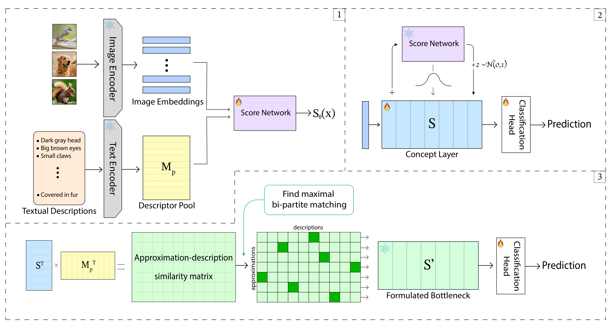

# CLEAR
#### Implementation of the paper "Conceptual-Learning via Embedding Approximations for Reinforcing Interpretability and Transparency"



### Datasets
Our code is running on the following datasets: CIFAR-10, CIFAR-100, Flowers102, Food101 and CUB-200-2011.

To use the CUB-200-2011 dataset, please download it from [here](https://www.kaggle.com/datasets/wenewone/cub2002011) and place it in `./data/CUB_200_2011`.

### Requirements
To run the code, you need to create an environment and install the following packages:
```
cd CLEAR
conda env create --name clear --file=environment.yml
conda activate clear
```
To install CLIP run:
```
! pip install git+https://github.com/openai/CLIP.git
```

### Running the code

#### CIFAR-10
To run the code for CIFAR-10 for 32 concepts, run:
```
python main.py --config configs/cifar10.yaml --num_attributes=3 --eps=1 --t=7 --lam=0.01 --seed=4 &
```
#### CIFAR-100
To run the code for CIFAR-100 for 32 concepts, run:
```
python main.py --config configs/cifar100_bn.yaml --num_attributes=3 --eps=0.1 --t=5 --lam=0.1 --seed=0 &
```
#### Flowers102
To run the code for Flowers102 for 32 concepts, run:
```
python main.py --config configs/flower.yaml --num_attributes=3 --eps=0.1 --t=5 --lam=0.01 --seed=1 &
```
#### Food101
To run the code for Food101 for 32 concepts, run:
```
python main.py --config configs/food_bn.yaml --num_attributes=3 --eps=1 --t=1 --lam=1 --seed=0 &
```
#### CUB-200-2011
To run the code for CUB-200-2011 for 32 concepts, run:
```
python main.py --config configs/cub.yaml --num_attributes=3 --eps=1 --t=10 --lam=1 --seed=0 &
```

### Parser options
The following options are available for the parser:

```
--config: dataset's configuration file
--seed: random seed value
--num_attributes: the number of attributes
--eps, --t, --lam: loss hyperparameters
--reg_type: the type of regularization
--selection_method: concept selection method
--save_attribute_embeddings: save the descriptors pool's embeddings
--save_chosen_concepts: save the selected concepts
```

#### Modify the number of attributes

For each dataset, the attributes options are as follows:
```
- {1: 8, 2: 16, 3: 32, 4: 64, 5: 128, 6: 256, 7: |classes|, 8: 2|classes|, 9: full attributes}
```
To choose your desired number of attributes, you can add your values to `config_num_att_dict` in the function `update_num_attributes` located in `dataset_utils.py`.

### References
Our work integrates the code by Yan et al. (2023) on ["Learning Concise and Descriptive Attributes for Visual Recognition"](https://arxiv.org/pdf/2308.03685). 
The git repository for their paper can be found [here](https://github.com/wangyu-ustc/LM4CV).
